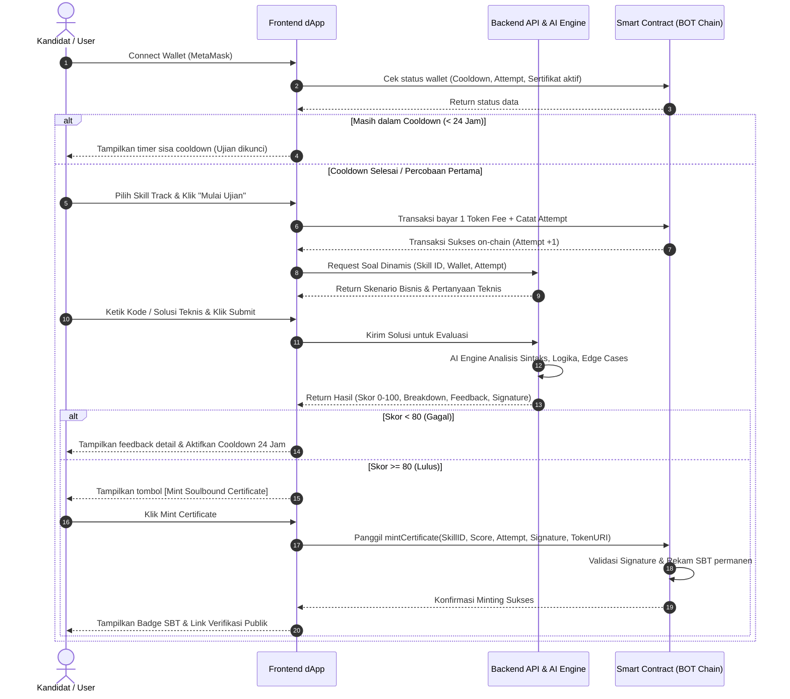
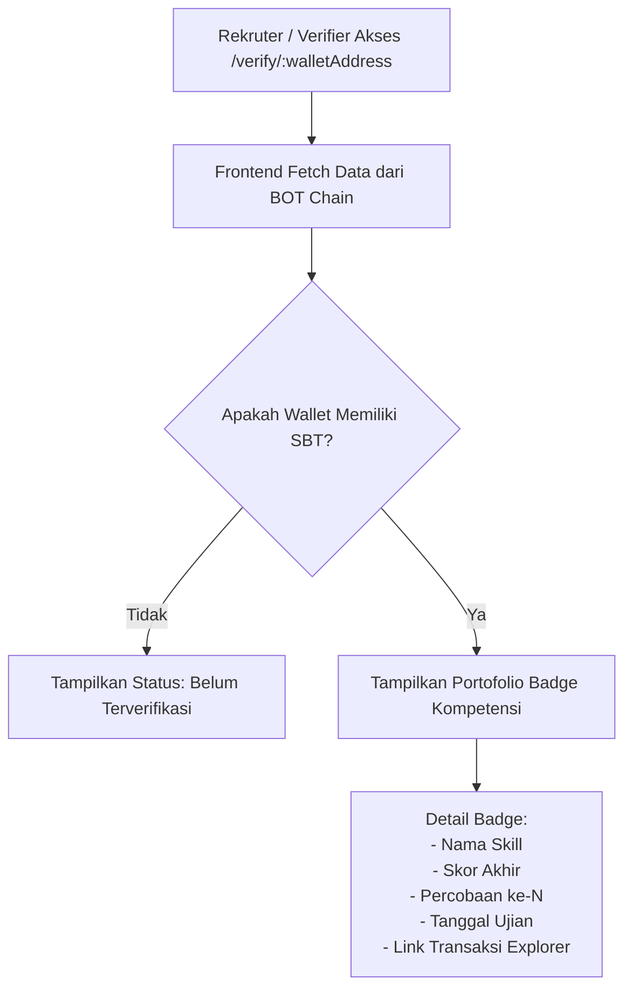
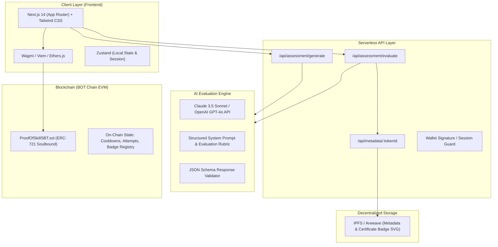

# Product Requirements Document (PRD)
# ProofOfSkill (PoS) — Decentralized AI-Evaluated Skill Verification Protocol

**Version:** 1.0.0  
**Status:** Approved / Base Architecture  
**Author:** Ardi Gunawan Pratama & Azel  
**Last Updated:** September 19, 2026  
**Target Event:** Build Week Hackathon Vol. 2 (BOT Chain Ecosystem)  
**Repository / Working Directory:** `D:\Project\Proof-Of-Skills`

---

## 1. Executive Summary & Product Vision

### 1.1 Product Statement
**ProofOfSkill (PoS)** adalah protokol verifikasi kompetensi teknis berbasis kecerdasan buatan (*AI-driven*) dan *Soulbound Token* (SBT) di jaringan BOT Chain. Platform ini menyelesaikan krisis kepercayaan (*trust deficit*) pada rekrutmen talenta teknologi dengan menggantikan sertifikat kelulusan statis (*Certificate of Completion*) menjadi bukti kompetensi dinamis berbasis kinerja (*Proof of Competence*) yang terverifikasi secara permanen di blockchain.

### 1.2 The Core Problem
1. **Sertifikat Statis Kehilangan Kredibilitas:** Sertifikat kursus daring (Coursera, Udemy, sertifikat webinar) hanya membuktikan bahwa pengguna telah memutar video atau menyelesaikan kuis pilihan ganda yang jawabannya dapat disalin dari internet.
2. **Kelelahan Penilaian (*Assessment Fatigue*):** Kandidat dipaksa mengerjakan tes teknis yang berulang-ulang untuk setiap perusahaan yang dilamar, menghabiskan 4–8 jam per tes.
3. **Beban Operasional Rekruter & DAO:** Perusahaan dan organisasi terdesentralisasi (DAO) membuang ratusan jam tim senior engineer dan membayar puluhan juta rupiah per tahun untuk platform uji kode (HackerRank/Codility) hanya untuk menyaring resume palsu.
4. **Ketiadaan Portabilitas Reputasi:** Hasil ujian kandidat terkunci di basis data privat perusahaan penguji dan tidak dapat dibawa saat melamar ke tempat lain.

### 1.3 The Solution: ProofOfSkill
* **Ujian Studi Kasus Dinamis:** Menggunakan Large Language Model (LLM) untuk meng-generate skenario bisnis nyata dan skema data unik per sesi pengujian, mencegah kebocoran bank soal.
* **Evaluasi Multidimensi:** AI bertindak sebagai *Technical Lead* independen yang mengevaluasi logika, efisiensi komputasi, sintaks, serta penanganan kasus ekstrem (*edge cases*).
* **Soulbound Token (SBT) on BOT Chain:** Hasil kelulusan (skor $\ge 80$) dicetak langsung ke dompet kandidat sebagai NFT non-transferable yang memuat metadata nilai, waktu, dan jumlah percobaan (*attempts*).
* **Mekanisme Integritas Ekonomi:** Setiap percobaan dikenakan biaya mikrotas (*assessment fee* sebesar 1 token testnet/native) dan jeda waktu (*cooldown*) 24 jam jika gagal, mengeliminasi strategi tebak-coba (*brute-force*).

---

## 2. Hackathon Context & Track Alignment

### 2.1 Konteks Acara
* **Nama Acara:** Build Week Hackathon Vol. 2
* **Penyelenggara:** Girl Meets Tech x BOT Chain Ecosystem
* **Jaringan Sasaran:** BOT Chain (EVM Compatible)
* **Batas Akhir Pengumpulan:** 25 September 2026, 23:59 WIB (GMT+7)

### 2.2 Keselarasan Jalur (Track Alignment)
ProofOfSkill berada pada persimpangan **AI Track** dan **RWA/Credential Track**:
1. **AI Component:** Penggunaan AI Engine untuk pembuatan soal kontekstual dan *scoring rubric evaluation*.
2. **On-Chain Component:** Smart contract Soulbound Token di BOT Chain dengan pencatatan status pengujian, pembatasan cooldown, dan hak verifikasi publik.

### 2.3 Kepatuhan 7 Syarat Wajib Hackathon
1. **Smart Contract Address:** Dideploy di BOT Chain Testnet/Mainnet dan terverifikasi di explorer.
2. **Live Domain:** dApp dapat diakses publik via browser tanpa instalasi lokal.
3. **Repositori GitHub:** Publik, memuat kode `.sol`, modul frontend, API, dan panduan `README.md`.
4. **Postingan X (Twitter):** Memperkenalkan proyek dengan mention `@BOTChain_ai`.
5. **Aktivitas Akun X:** Memenuhi syarat histori interaksi aktif.
6. **Mainnet/Launch Announcement:** Artikel rilis produk di Mirror/Medium.
7. **Branding Kemitraan:** Logo resmi dan tautan BOT Chain di bagian footer web.

---

## 3. User Personas & Core Workflows

### 3.1 User Personas

| Persona | Profil & Kebutuhan | Pain Point | Nilai yang Diterima |
| :--- | :--- | :--- | :--- |
| **Kandidat / Pelajar Tech** | Mahasiswa/Fresh Graduate (e.g., Data Science/Software Eng) yang ingin membuktikan keahlian nyata. | CV sering diabaikan karena belum punya pengalaman kerja formal; lelah tes koding berulang. | Bukti kompetensi on-chain yang kredibel, dapat dipamerkan di LinkedIn/portfolio. |
| **Rekruter / Engineering Lead** | Tim rekrutmen startup atau institusi tech yang menyaring ratusan pelamar. | 80% resume melebih-lebihkan kemampuan; biaya platform tes pihak ketiga mahal. | Verifikasi instan melalui alamat wallet pelamar; filter kandidat berdasarkan skor & attempt. |
| **DAO Core Contributor** | Pengelola proyek Web3 yang merekrut kontributor secara anonim (*pseudonymous*). | Tidak bisa memeriksa latar belakang formal/ijazah fisik kandidat. | Verifikasi reputasi teknis secara murni on-chain tanpa perlu melanggar privasi kandidat (*no doxxing*). |

---

### 3.2 End-to-End User Flow



---

### 3.3 Verification Flow (Recruiter / Public Viewer)



---

## 4. Scope of MVP (Pilihan Jalur Skill Awal)

Pada rilis MVP Hackathon, ProofOfSkill membatasi pengujian pada 3 track kurasi industri:

### Track 1: SQL for Data Analytics
* **Konteks Industri:** E-commerce Transactional & Product Analytics.
* **Fokus Uji:** Kompleksitas query agregasi, multi-table JOINs, subqueries/CTEs, Window Functions (`ROW_NUMBER`, `DENSE_RANK`), penanganan nilai `NULL`, dan optimasi indexing logic.
* **Skema Data Mock:** `users`, `orders`, `order_items`, `products`.

### Track 2: Python for Data Manipulation & Wrangling
* **Konteks Industri:** Financial Data Cleansing & Feature Engineering.
* **Fokus Uji:** Manipulasi DataFrame (Pandas/Polars), penanganan *outliers*, pengisian *missing values*, transformasi tipe data, *chaining operations*, dan efisiensi memori (vektorisasi vs looping).
* **Format Jawaban:** Script Python terstruktur atau fungsi modular.

### Track 3: Solidity & Smart Contract Fundamentals
* **Konteks Industri:** Web3 DeFi & Tokenized State Management.
* **Fokus Uji:** Pengelolaan status (*storage vs memory*), kontrol akses (`Ownable`, peran), penanganan error (`require`, `revert`), pencegahan *reentrancy*, dan optimalisasi penggunaan gas.
* **Format Jawaban:** Potongan kontrak Solidity atau fungsi koreksi kerentanan.

---

## 5. System Architecture & Tech Stack



### 5.1 Technology Selection Matrix

| Komponen | Pilihan Teknologi | Alasan Pemilihan |
| :--- | :--- | :--- |
| **Smart Contract** | Solidity ^0.8.20 | Standar EVM modern, kompatibel penuh dengan BOT Chain dan Remix IDE. |
| **Frontend Framework** | Next.js 14 (TypeScript) | Standar industri, performa tinggi, native API routes untuk backend serverless. |
| **Styling & UI** | Tailwind CSS + Lucide Icons | Pengembangan UI responsif cepat, ukuran bundle kecil, mudah dikustomisasi. |
| **Web3 Connection** | Wagmi + Viem + RainbowKit | Manajemen state koneksi dompet paling stabil dan ringan untuk dApp EVM. |
| **AI LLM Backend** | Anthropic Claude 3.5 Sonnet / GPT-4o | Unggul dalam evaluasi logika kode, pemahaman instruksi ketat, dan output JSON terstruktur. |
| **Metadata Storage** | IPFS via Pinata / Web3.Storage | Desentralisasi metadata NFT agar token tidak bergantung pada server statis. |
| **Hosting / Deployment**| Vercel / Cloudflare Pages | Dukungan CI/CD instan, uptime tinggi, konfigurasi domain kustom mudah. |

---

## 6. Smart Contract Specification

### 6.1 Contract Overview: `ProofOfSkillSBT.sol`
Smart contract mengimplementasikan standar **ERC-721** dengan modifikasi fungsi transfer untuk menjadikannya **Soulbound** (tidak dapat dipindahtangankan).

* **Standar:** ERC-721 Soulbound (Non-transferable).
* **Jaringan:** BOT Chain (EVM).
* **Mata Uang Biaya:** Native BOT Token / Testnet Native Currency.

### 6.2 State Variables & Data Structures

```solidity
// Struct untuk menyimpan data kredensial
struct Certificate {
    uint8 skillId;         // 1: SQL, 2: Python, 3: Solidity
    uint16 score;          // Nilai 0 - 100
    uint8 attemptCount;    // Jumlah percobaan hingga lulus
    uint256 completionDate;// Unix timestamp kelulusan
    string tokenURI;       // URI metadata IPFS
}

// Struct untuk melacak status pengerjaan kandidat
struct CandidateState {
    uint8 currentAttempts; // Total percobaan yang telah diambil
    uint256 lastAttemptTime;// Timestamp percobaan terakhir
    bool isCertified;      // Apakah sudah memiliki sertifikat aktif
}
```

### 6.3 State Mappings
* `mapping(address => mapping(uint8 => CandidateState)) public candidateProgress;`
* `mapping(uint256 => Certificate) public certificates;`
* `mapping(address => mapping(uint8 => uint256)) public userCertificates;` // Address + SkillID -> TokenID
* `address public aiSignerAddress;` // Public key backend AI untuk verifikasi hasil
* `uint256 public assessmentFee = 1 ether;` // 1 Token native per attempt
* `uint256 public constant COOLDOWN_PERIOD = 24 hours;`

### 6.4 Core Functions Specification

#### 1. `startAssessment(uint8 skillId) external payable`
* **Prasyarat:**
  * `msg.value == assessmentFee`
  * `candidateProgress[msg.sender][skillId].isCertified == false` (tidak boleh tes jika sudah bersertifikat).
  * `block.timestamp >= candidateProgress[msg.sender][skillId].lastAttemptTime + COOLDOWN_PERIOD` (cek batas cooldown).
* **Aksi:**
  * Tambahkan `candidateProgress[msg.sender][skillId].currentAttempts += 1`.
  * Perbarui `candidateProgress[msg.sender][skillId].lastAttemptTime = block.timestamp`.
  * Emit event `AssessmentStarted(address indexed candidate, uint8 indexed skillId, uint8 attempt)`.

#### 2. `mintCertificate(uint8 skillId, uint16 score, uint8 attempt, string memory uri, bytes memory signature) external`
* **Prasyarat:**
  * `score >= 80` (passing grade mutlak).
  * `candidateProgress[msg.sender][skillId].isCertified == false`.
  * Verifikasi tanda tangan kriptografis (`ECDSA.recover`) dari `aiSignerAddress` untuk memastikan data `(msg.sender, skillId, score, attempt)` sah dan tidak dimanipulasi di sisi client.
* **Aksi:**
  * Cetak token ID baru ke `msg.sender`.
  * Simpan struct `Certificate`.
  * Tandai `candidateProgress[msg.sender][skillId].isCertified = true`.
  * Emit event `CertificateIssued(address indexed candidate, uint8 indexed skillId, uint256 tokenId, uint16 score)`.

#### 3. `_update(address to, uint256 tokenId, address auth) internal override returns (address)`
* **Override Logic (Soulbound Enforcer):**
  * Izinkan pencetakan awal: `from == address(0)`.
  * Izinkan penghapusan token (*burn*): `to == address(0)`.
  * **Tolak semua transfer antar wallet:** Jika `from != address(0)` dan `to != address(0)`, eksekusi `revert("ProofOfSkill: Soulbound tokens cannot be transferred")`.

---

## 7. AI Assessment & Evaluation Engine

### 7.1 Architecture Flow
AI Engine beroperasi melalui backend endpoint serverless untuk menjaga kerahasiaan API key dan kunci penandatangan (*signing key*).

```
[Client Request: Solusi User]
             │
             ▼
[Next.js API: /api/assessment/evaluate]
             │
   ┌─────────┴─────────┐
   ▼                   ▼
[Validasi Sesi]    [Format Prompt Rubrik]
                       │
                       ▼
             [LLM Engine Call]
             (Temperature: 0.1 untuk konsistensi evaluasi)
                       │
                       ▼
             [Parser JSON Output]
                       │
             ┌─────────┴─────────┐
             │                   │
      [Skor < 80]          [Skor >= 80]
             │                   │
             ▼                   ▼
    [Kirim Response      [Generate ECDSA Signature
     Feedback Saja]       & Kirim Token Data]
```

### 7.2 Prompt Engineering: Dynamic Question Generator
```text
System: Anda adalah Lead Technical Evaluator di bidang {SKILL_TRACK}.
Tugas Anda adalah membuat 1 studi kasus teknis berbasis skenario bisnis dunia nyata.

Spesifikasi:
- Tingkat Kesulitan: Intermediate hingga Advanced.
- Buat konteks bisnis yang relevan (misal: analisis penurunan retensi pengguna, perhitungan valuasi inventori, deteksi pola transaksi mencurigakan).
- Sertakan Mock Schema data (nama tabel, kolom, tipe data).
- Berikan pertanyaan spesifik yang menuntut pemecahan masalah dengan efisiensi komputasi tinggi.
- DILARANG memberikan pertanyaan teoretis atau hafalan definisi.

Format Output (Wajib JSON murni):
{
  "scenario_title": "...",
  "business_context": "...",
  "schema_definition": "...",
  "problem_statement": "...",
  "evaluation_criteria": ["..."]
}
```

### 7.3 Prompt Engineering: Evaluation & Scoring Rubric
```text
System: Anda adalah Chief Technical Auditor. Evaluasi jawaban kandidat secara ketat, objektif, dan tanpa kompromi.

Input:
- Soal & Kriteria: {PROBLEM_JSON}
- Solusi Kandidat: {USER_SOLUTION}

Rubrik Penilaian (Total Skor: 100):
1. Fungsionalitas & Kebenaran Logika (Bobot 40%): Apakah solusi memecahkan masalah yang diminta secara presisi?
2. Efisiensi & Kinerja (Bobot 25%): Apakah kode menggunakan pendekatan optimal (kompleksitas algoritma, minimasi subquery boros, penggunaan memori)?
3. Penanganan Kasus Ekstrem / Edge Cases (Bobot 20%): Bagaimana penanganan NULL values, duplikasi data, pembagian dengan nol, atau kondisi batas?
4. Kualitas Sintaks & Konvensi Penulisan (Bobot 15%): Keterbacaan kode, format penulisan, dan kerapian struktur.

Passing Grade: 80.

Format Output (Wajib JSON murni):
{
  "score": <0-100>,
  "passed": <true/false>,
  "rubric_breakdown": {
    "logic_score": <0-40>,
    "efficiency_score": <0-25>,
    "edge_cases_score": <0-20>,
    "syntax_score": <0-15>
  },
  "strengths": "...",
  "areas_for_improvement": "...",
  "detailed_feedback": "..."
}
```

---

## 8. API Specifications

### 8.1 `POST /api/assessment/generate`
Membuat soal dinamis berdasarkan pilihan track.

* **Headers:** `Content-Type: application/json`
* **Request Body:**
  ```json
  {
    "walletAddress": "0x71C...3a9",
    "skillId": 1
  }
  ```
* **Response (200 OK):**
  ```json
  {
    "sessionId": "sess_98f12a8b",
    "skillId": 1,
    "skillName": "SQL for Data Analytics",
    "scenarioTitle": "E-Commerce Customer Retention & Repurchase Analysis",
    "businessContext": "Tim growth marketing membutuhkan data cohort pelanggan yang melakukan pembelian kedua dalam 14 hari.",
    "schema": "TABLE users (id INT, created_at TIMESTAMP); TABLE orders (id INT, user_id INT, amount DECIMAL, order_date TIMESTAMP);",
    "challenge": "Tuliskan query SQL ANSI untuk menghitung persentase retensi 14 hari per kuartal pendaftaran."
  }
  ```

### 8.2 `POST /api/assessment/evaluate`
Menilai solusi kandidat dan menghasilkan tanda tangan minting jika lulus.

* **Headers:** `Content-Type: application/json`
* **Request Body:**
  ```json
  {
    "sessionId": "sess_98f12a8b",
    "walletAddress": "0x71C...3a9",
    "skillId": 1,
    "solutionText": "WITH FirstOrders AS ( ... ) SELECT ... FROM FirstOrders ...;"
  }
  ```
* **Response: Lulus (200 OK):**
  ```json
  {
    "passed": true,
    "score": 88,
    "attempt": 1,
    "feedback": {
      "summary": "Logika window function sangat efisien dan penanganan NULL tepat.",
      "breakdown": {
        "logic": 38,
        "efficiency": 22,
        "edgeCases": 16,
        "syntax": 12
      }
    },
    "mintAuthorization": {
      "skillId": 1,
      "score": 88,
      "attempt": 1,
      "tokenURI": "ipfs://bafybeig.../metadata.json",
      "signature": "0x4a8f9c..."
    }
  }
  ```
* **Response: Gagal (200 OK):**
  ```json
  {
    "passed": false,
    "score": 64,
    "attempt": 1,
    "feedback": {
      "summary": "Query menghasilkan Cartesian product karena kondisi JOIN pada tabel orders tidak lengkap.",
      "breakdown": {
        "logic": 22,
        "efficiency": 14,
        "edgeCases": 15,
        "syntax": 13
      }
    },
    "cooldownUntil": 1726828800
  }
  ```

---

## 9. Frontend Specifications & Design System

### 9.1 Theme & Visual Identity
* **Gaya Visual:** Modern Web3 Dark Mode dengan aksen neon berdaya baca tinggi (*high-contrast accessibility*).
* **Warna Utama:**
  * Background Utama: `#0A0E17` (Deep Obsidian Black)
  * Surface / Card: `#131B2E` (Navy Slate)
  * Border / Dividers: `#1E293B` (Border Slate)
  * Primary Accent: `#38BDF8` (Cyber Sky Blue)
  * Success Accent: `#10B981` (Emerald Green)
  * Warning / Alert: `#F59E0B` (Amber Orange)
  * Text Primary: `#F8FAFC` (Pure White)
  * Text Secondary: `#94A3B8` (Slate Gray)
* **Tipografi:** Inter atau JetBrains Mono (untuk blok kode dan query editor).

### 9.2 Halaman & Tampilan Utama

1. **Header / Navbar:**
   * Logo `ProofOfSkill (PoS)`
   * Navigasi: `Assessments`, `My Badges`, `Verify Profile`
   * Tombol Connect Wallet (RainbowKit / MetaMask) dengan indikator jaringan BOT Chain.

2. **Dashboard / Assessment Catalog:**
   * Kartu untuk 3 pilihan jalur skill (SQL, Python, Solidity).
   * Status per jalur: `Belum Diambil`, `Terkunci (Cooldown)`, atau `Tersertifikasi (Skor & Attempt)`.
   * Tombol `Mulai Ujian (Biaya: 1 BOT Token)`.

3. **Active Assessment Studio:**
   * Panel Kiri: Skenario bisnis, skema tabel, dan instruksi studi kasus.
   * Panel Kanan: Code/Query Editor interaktif dengan *syntax highlighting* dan tombol `Submit for AI Review`.
   * Timer Sesi Pengerjaan (opsional visual, misal 30 menit).

4. **Evaluation Result Modal:**
   * Animasi evaluasi loading ("AI Lead is analyzing your submission...").
   * Skor gauge melingkar (0–100).
   * Rincian 4 metrik rubrik penilaian.
   * Feedback tertulis dari AI.
   * Jika Skor $\ge 80$: Tombol `Mint Soulbound Badge on BOT Chain`.
   * Jika Skor $< 80$: Notifikasi jadwal cooldown 24 jam.

5. **Public Verification Page (`/verify/[walletAddress]`):**
   * Header profil dompet pengguna.
   * Galeri lencana Soulbound Token yang dimiliki.
   * Klik lencana membuka modal: Skor, nomor percobaan, tanggal terbit, transaction hash di explorer BOT Chain, dan bukti metadata.

6. **Footer (Kepatuhan Wajib):**
   * Teks: *"Powered by BOT Chain Ecosystem"*.
   * Logo resmi BOT Chain yang menautkan ke situs resmi jaringan.

---

## 10. Security, Integrity & Anti-Cheat Mechanisms

1. **Server-Side Cryptographic Signature (Anti-Spoofing):**
   * Pengguna tidak bisa memanggil fungsi `mintCertificate` secara mandiri tanpa bukti kelulusan.
   * Smart contract memverifikasi tanda tangan ECDSA yang diterbitkan oleh private key resmi backend AI. Setiap percobaan manipulasi skor di sisi frontend akan ditolak oleh kontrak.
2. **On-Chain Cooldown & Attempt Enforcement:**
   * Data percobaan dan jeda waktu dicatat di status smart contract. Pengguna tidak bisa melewati cooldown dengan membersihkan cache browser atau berganti peramban.
3. **Sybil & Economic Resistance:**
   * Biaya ujian 1 Token BOT mencegah pembuatan ribuan akun bot untuk menebak pola soal.
4. **Soulbound Token Restriction:**
   * Standar transfer dinonaktifkan di tingkat bytecode kontrak, memastikan sertifikat tidak dapat diperjualbelikan atau dipindahkan ke dompet lain.

---

## 11. 5-Day Implementation Roadmap (Sprint Plan)

*Target Penyelesaian: 19 September 2026 – 24 September 2026*

| Hari | Target & Deliverables | PIC / Status |
| :--- | :--- | :--- |
| **Hari 1 (19 Sept)** | - Finalisasi arsitektur & PRD.<br/>- Pembuatan smart contract `ProofOfSkillSBT.sol`.<br/>- Testing unit contract via Foundry/Hardhat/Remix.<br/>- Deploy & Verify contract di testnet BOT Chain. | In Progress |
| **Hari 2 (20 Sept)** | - Inisialisasi proyek Next.js 14 di `D:\Project\Proof-Of-Skills`.<br/>- Integrasi RainbowKit / Wagmi untuk koneksi wallet BOT Chain.<br/>- Pembuatan komponen UI dasar (Navbar, Footer BOT Chain, Assessment Cards). | Scheduled |
| **Hari 3 (21 Sept)** | - Pembuatan API route `/api/assessment/generate` & `/api/assessment/evaluate`.<br/>- Integrasi LLM API dengan rubrik penilaian terstruktur.<br/>- Mekanisme penandatanganan ECDSA pada backend API. | Scheduled |
| **Hari 4 (22 Sept)** | - Integrasi interaksi frontend ke smart contract (Bayar fee & Mint SBT).<br/>- Pembuatan halaman profil publik `/verify/[walletAddress]`.<br/>- Uji coba alur transaksi end-to-end dari browser. | Scheduled |
| **Hari 5 (23 Sept)** | - Deployment aplikasi ke live domain (Vercel/Cloudflare).<br/>- Pengujian verifikasi kontrak pada block explorer BOT Chain.<br/>- Desain grafis badge SVG on-chain / IPFS. | Scheduled |
| **Hari 6 (24 Sept)** | - Perekaman video demo produk (2–3 menit).<br/>- Penulisan dokumentasi `README.md` komprehensif di repositori GitHub.<br/>- Publikasi artikel rilis di Mirror/Medium & tweet submission ke `@BOTChain_ai`. | Scheduled |

---

## 12. Future Roadmap (Post-Hackathon Expansion)

1. **Permissionless Recruiter Bounties:**
   Perusahaan teknologi dapat membuat portal asesmen mandiri, menyetor reward token, dan menetapkan rubrik kustom untuk mencari kandidat spesifik.
2. **Dynamic NFT Visuals (Evolving Badges):**
   Lencana NFT yang dapat berevolusi secara visual saat kandidat menyelesaikan lebih banyak studi kasus tingkat lanjut atau mempertahankan performa konsisten.
3. **ZK-Proofs for Private Competence Verification:**
   Memungkinkan kandidat membuktikan bahwa mereka memiliki skor $\ge 85$ tanpa harus mengekspos alamat dompet publik mereka secara penuh (*Zero-Knowledge Skill Proof*).
4. **Multi-Chain Credential Bridging:**
   Penerbitan identitas lintas rantai melalui protokol interoperabilitas seperti LayerZero atau Chainlink CCIP.

---

*Dokumen ini merupakan acuan tunggal dan sah (Single Source of Truth) untuk seluruh implementasi teknis dan desain produk ProofOfSkill.*
